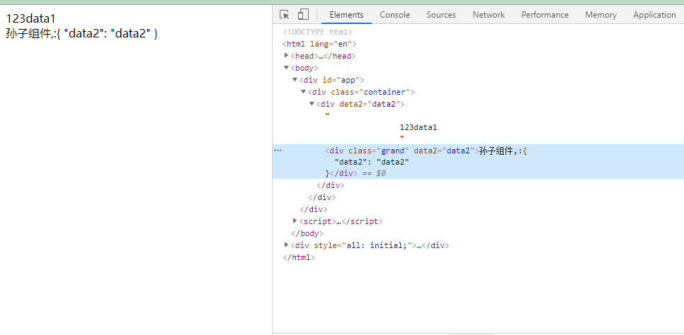

### $attrs和$listeners
1. 官方定义:
>包含了父作用域中不作为 prop 被识别 (且获取) 的 attribute 绑定 (class 和 style 除外)。当一个组件没有声明任何 prop 时，这里会包含所有父作用域的绑定 (class 和 style 除外)，并且可以通过 v-bind="$attrs" 传入内部组件——在创建高级别的组件时非常有用。

简而言之,就是父组件中除了props没接受的变量,不包过class和style
2. 目的
单层父子组件的通信我们一般使用props,但多层情况下使用props,会显得冗杂反复.所以我们可以选择状态管理器,如vuex,
$attrs就是2,4以来官方提供的api,vm.$attrs

3. 实例
```$xslt
<div id="app">
    <div class="container">
        <child :name="data1" :data2="data2"></child>
    </div>
</div>
<script>
let app = new Vue({
    el:'#app',
    data:{
       data1:'data1',
       data2:'data2'
    },
    components:{
        'child':{
            template:`<div>123{{name}}</div>`,
            props:['name'],
           mounted:function(){
             console.log(this)//
           },
        }
    }
})
```
  

可以看到,bind绑定的属性,如果未用props接受的话会作为html元素的属性进行渲染,可以通过$attrs进行获取.
**inheritAttrs**  
如果我们不想这些属性显示的绑定到元素上的话,可以设置inheritAttrs:false
```$xslt
components:{
        'child':{
            template:`<div>123{{name}}</div>`,
            props:['name'],
            inheritAttrs:false,
           mounted:function(){
             console.log(this)//
           },
        }
    }
```


3. 多层组件的使用
语法:v-bind='$attrs' 

  

4. 好处
方便多层嵌套传值,不用一层层手从props传值.如果需要继续传递props值,也可以手动用:ex='ex',进行传值

5. inheritAttrs属性补充说明  
官方说明:
>默认情况下父作用域的不被认作 props 的 attribute 绑定 (attribute bindings) 将会“回退”且作为普通的 HTML attribute 应用在子组件的根元素上。当撰写包裹一个目标元素或另一个组件的组件时，这可能不会总是符合预期行为。通过设置 inheritAttrs 到 false，这些默认行为将会被去掉。而通过 (同样是 2.4 新增的) 实例 property $attrs 可以让这些 attribute 生效，且可以通过 v-bind 显性的绑定到非根元素上。
  注意：这个选项不影响 class 和 style 绑定。

从上面的用法我们我们很容易理解第一句话,而第二句中的不符合预期就不容易理解,其实也很简单,当key值与html本身默认值冲突时,会覆盖掉默认值,我们可以看下例子:
```$xslt
<div id="app">
    <div class="container">
        <inherit type="date" name="王八"></inherit>
    </div>
</div>
<script>
let app = new Vue({
    el:'#app',
    data:{
       data1:'data1',
       data2:'data2'
    },
    components:{
        'inherit':{
            template:`<input type="number" />`
        }
    }
})
</script>
```
  
可以看到,父组件传递的type,date值覆盖了原先input 的 type number值  
>**如果需要date值,但又不想要覆盖的情况就设置inheritAttrs为false,然后通过this.$attrs.type获取就好了**
