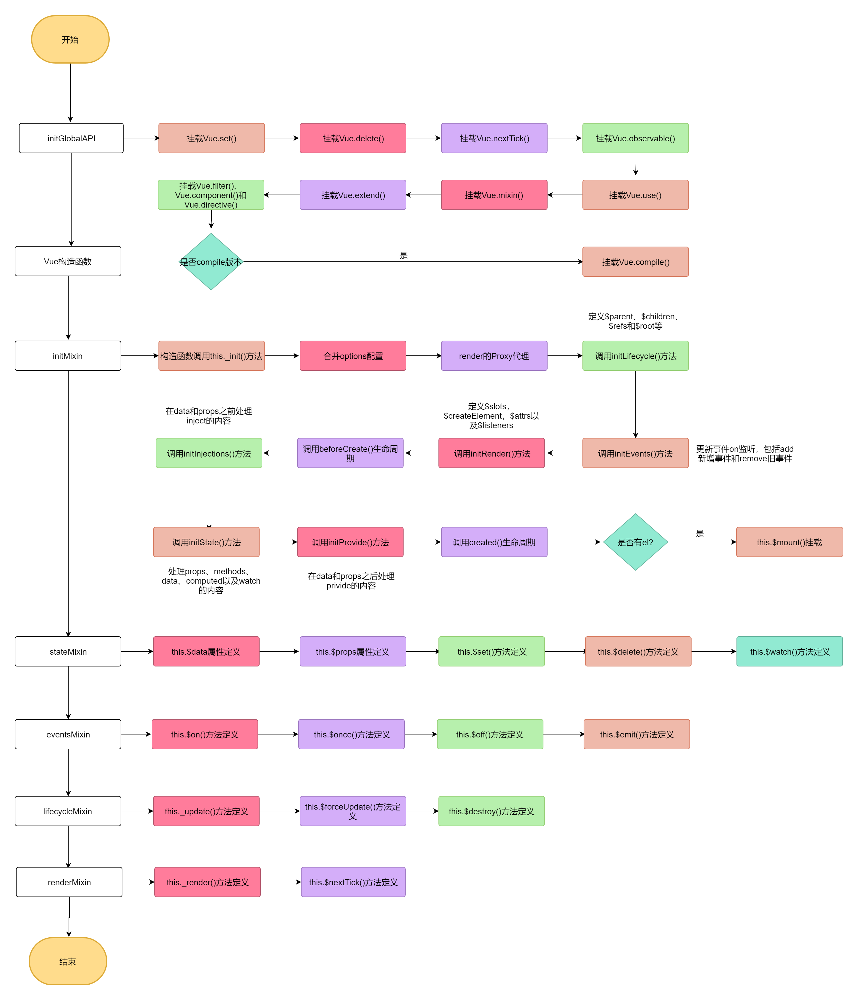

## 整体流程

/instance/index.js export Vue
instance目录结构:
- instance
     - render-helpers  #render渲染相关的工具函数目录
     - events.js
     - init.js      #_init初始化等方法
     - inject.js
     - lifecycle.js
     - proxy.js
     - render.js
     - state.js
     - index.js      #入口文件
initMixin(Vue)
stateMixin(Vue)
eventsMixin(Vue)
lifecycleMixin(Vue)
renderMixin(Vue)

/core/index.js import Vue
initGlobalAPI(Vue)

