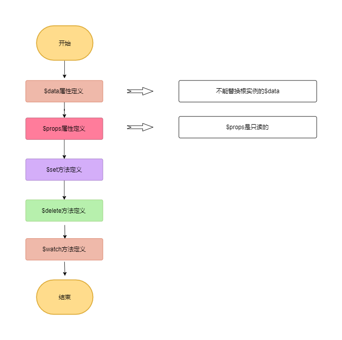

### stateMixin 流程
stateMixin主要是处理vue实例方法和数据,包括$data,$props,$set,$delete,$watch,
**文件位置:src/core/instance/state.js**
```js
  const dataDef = {}
  dataDef.get = function () { return this._data }
  const propsDef = {}
  propsDef.get = function () { return this._props }
  Object.defineProperty(Vue.prototype, '$data', dataDef)
  Object.defineProperty(Vue.prototype, '$props', propsDef)
```
可以看出$data和$props主要是对_data和_props的getter的访问代理,但对set方法进行了劫持,
```js
if (process.env.NODE_ENV !== 'production') {
    dataDef.set = function () {
      warn(
        'Avoid replacing instance root $data. ' +
        'Use nested data properties instead.',
        this
      )
    }
    propsDef.set = function () {
      warn(`$props is readonly.`, this)
    }
  }
```
* $set和$delete方法呗定义在**src/core/observer/index.js**中,
```js
  Vue.prototype.$set = set
  Vue.prototype.$delete = del

 function set (target: Array<any> | Object, key: any, val: any): any {
  //数组的处理
  if (Array.isArray(target) && isValidArrayIndex(key)) {
    target.length = Math.max(target.length, key)
    target.splice(key, 1, val)
    return val
  }
  //对象的处理
  if (key in target && !(key in Object.prototype)) {
    target[key] = val
    return val
  }
  const ob = (target: any).__ob__
  if (!ob) {
    target[key] = val
    return val
  }
  defineReactive(ob.value, key, val)
  ob.dep.notify()
  return val
}
/**
 * Delete a property and trigger change if necessary.
 */
export function del (target: Array<any> | Object, key: any) {
  if (Array.isArray(target) && isValidArrayIndex(key)) {
    target.splice(key, 1)
    return
  }
  const ob = (target: any).__ob__
  if (!hasOwn(target, key)) {
    return
  }
  delete target[key]
  if (!ob) {
    return
  }
  ob.dep.notify()
}
```


