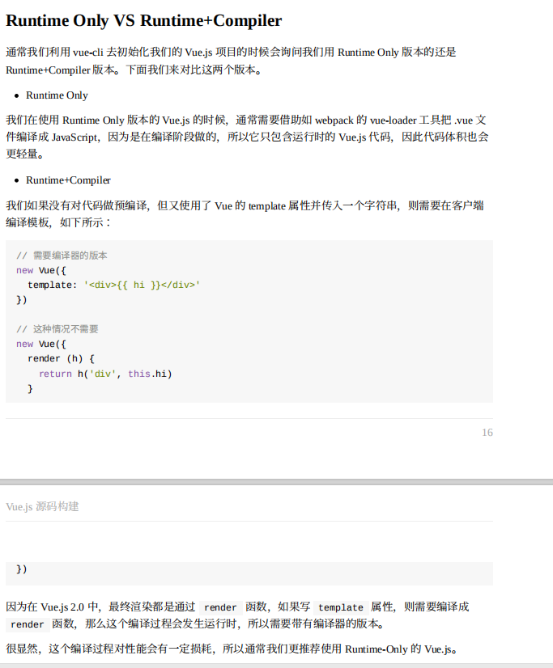

通常使用vue-cli初始化项目时，会让我们选择vue版本，Runtime Onlutime Onlu还是Runtime + Compiler，这两个版本的差异主要在于compiler版本是对代码做过了预编译,
预编译的作用是将vue的template模版进行了编译,最终渲染成render函数，故而性能也略差一点 
  因为浏览器本身并不能直接解析template模版.所以当你使用了runtime Only的版本开发时就不能使用template模版,通常的做法是需要借助如webpack的vue-loader工具去解析.vue
  文件,

